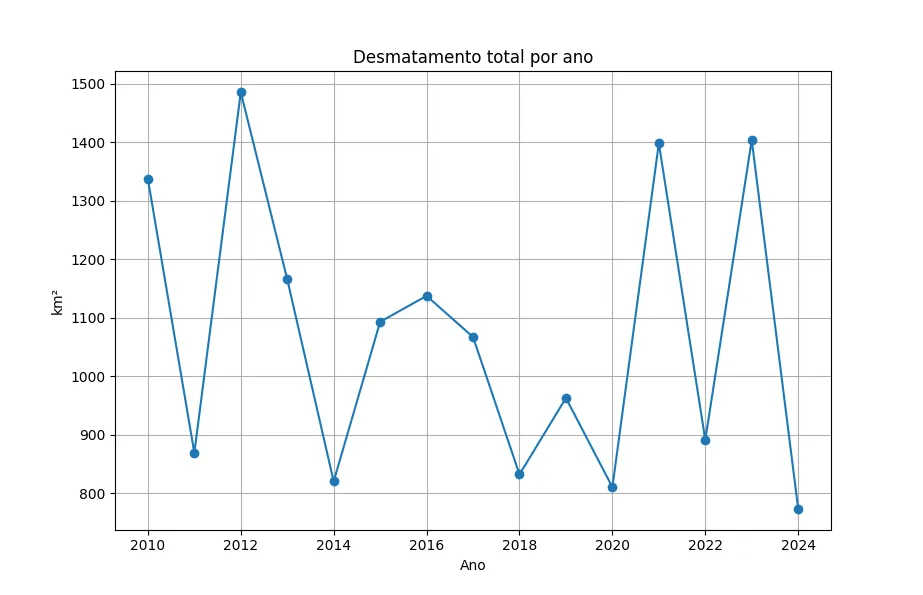
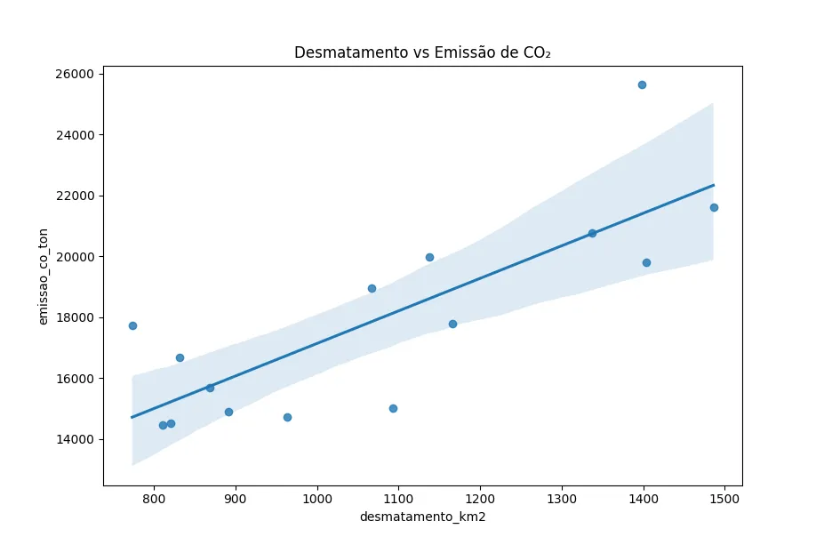
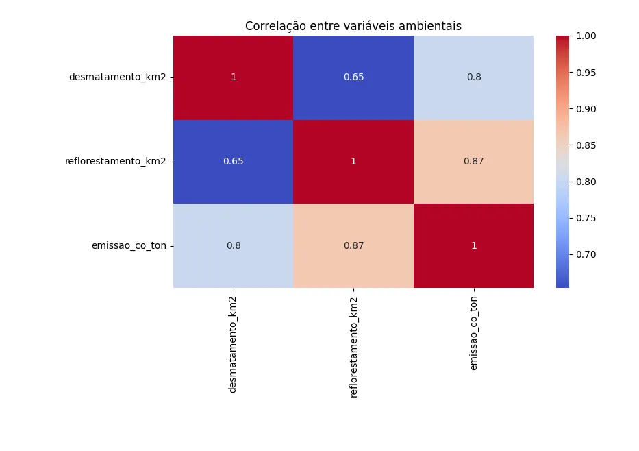

# Análise de Impacto Ambiental no Brasil (dados ficticios)

Este projeto realiza uma análise exploratória e analítica de dados ambientais do Brasil,
com foco em desmatamento, reflorestamento e emissão de CO₂.

O objetivo é transformar dados brutos em insights claros que apoiem decisões de políticas
ambientais, projetos de ONGs e análises estratégicas baseadas em dados.

### Estrutura dos Dados

Os dados utilizados representam medições ambientais anuais por estado brasileiro.

**Principais colunas:**

- `ano` — Ano da medição
- `estado` — Estado brasileiro
- `area_desmatada_km2` — Área desmatada (km²)
- `area_reflorestada_km2` — Área reflorestada (km²)
- `emissao_co2_ton` — Emissão estimada de CO₂ (toneladas)
- `fonte_dado` — Origem da informação

### Pipeline de Análise

1. Leitura dos dados brutos
2. Diagnóstico inicial (tipos, valores ausentes e inconsistências)
3. Limpeza e tratamento:
   - Conversão de tipos
   - Remoção de registros inválidos
   - Preenchimento de valores ausentes
   - Tratamento simples de outliers
4. Geração de base analítica limpa
5. Agregações por ano e estado
6. Visualizações e análise de correlação

🔹 Análises Realizadas

Desmatamento Total por Ano

    <em>Evolução do desmatamento total ao longo dos anos</em> 

Ranking de Desmatamento por Estado

    <em>Estados com maior área total desmatada no período analisado</em> 

Relação entre Desmatamento e Emissão de CO₂

    <em>Correlação positiva entre desmatamento anual e emissão de CO₂</em> 

Matriz de Correlação entre Variáveis Ambientais

    <em>Correlação entre desmatamento, reflorestamento e emissão de CO₂ (dados anuais agregados)</em> 

A matriz de correlação evidencia uma forte relação positiva entre desmatamento e emissão de CO₂,
indicando impacto ambiental imediato da perda de cobertura vegetal.

Observa-se também correlação positiva entre reflorestamento e emissão de CO₂, o que sugere que
ações de reflorestamento tendem a ocorrer em períodos de maior degradação ambiental.
Os efeitos positivos do reflorestamento sobre as emissões são de longo prazo e não se refletem
diretamente em dados anuais agregados.
